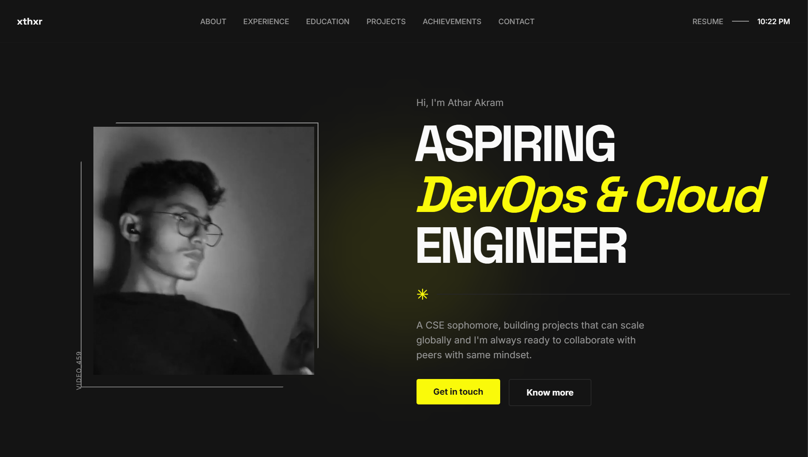

# xthxr.dev

Welcome to **xthxr.dev** — the personal portfolio of [Athar Akram](https://github.com/xthxr)!

This site serves as a digital showcase of my work, technical skills, and interests as a developer. Whether you’re a fellow coder, a prospective collaborator, or just browsing for inspiration, you’ll find a curated collection of my favorite projects and experiments here.

---

## 🧑‍💻 About Me

I'm Athar Akram, a passionate developer with a love for building modern web experiences. My primary tools are TypeScript, React, and the latest in front-end technologies. I enjoy solving problems, learning new frameworks, and sharing what I discover with the community.

---

## 🚀 Tech Stack

- **TypeScript** — The powerhouse language behind this site
- **React / Next.js** — For dynamic, high-performance UI
- **Tailwind CSS** — For rapid, utility-first styling
- **Vercel** — For fast, reliable deployment

---

## ✨ Features

- **Project Gallery:** Explore my best work with live demos and source code.
- **Contact:** Find ways to get in touch or connect for collaboration.

---

## 🖼️ Preview

---
